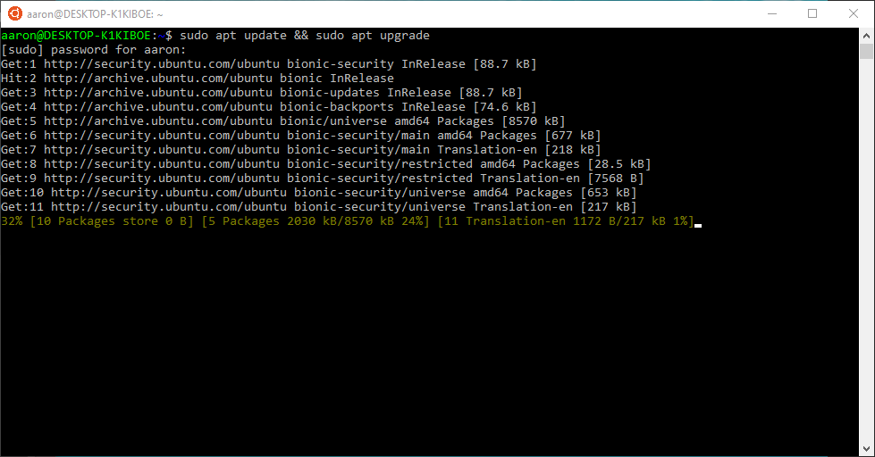
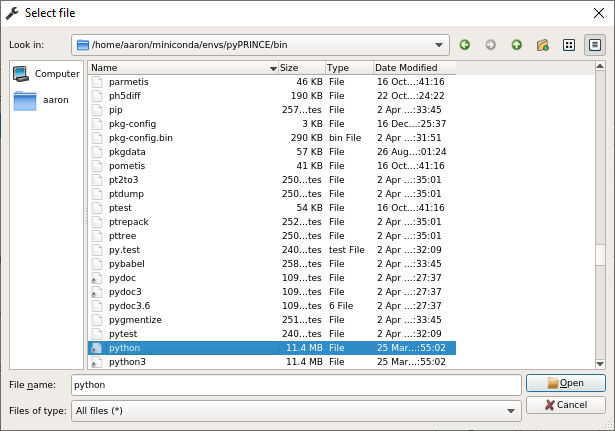

.. note::
   If you have already installed fish2eod and its dependencies and would like to update it you can run
   .. code-block:: bash

      pip install git+https://github.com/aaronshifman/fish2eod.git --upgrade

   Please remember that you must be in the correct conda environment

Installation
============

.. _linux-install:

Linux
-----

Formally fish2eod has only been tested with Ubuntu 18.04. This is because there is a gmsh requirement >= 3.0 and
previous versions of Ubuntu have an out of date version on apt. If you can install gmsh separately any version should
work

You're going to want to download the :download:`conda specification <https://raw.githubusercontent.com/aaronshifman/fish2eod/master/conda_environment.yml>`
and the install scripts for :download:`conda <https://raw.githubusercontent.com/aaronshifman/fish2eod/master/install_conda.sh>`
and :download:`dependancies <https://raw.githubusercontent.com/aaronshifman/fish2eod/master/install_linux.sh>`

If you're using a browser you can "right-click"-"save as" to download the file or if using the command line

.. code-block:: bash

   curl https://raw.githubusercontent.com/aaronshifman/fish2eod/master/conda_environment.yml -L --output conda_environment.yml
   curl https://raw.githubusercontent.com/aaronshifman/fish2eod/master/install_conda.sh -L --output install_conda.sh
   curl https://raw.githubusercontent.com/aaronshifman/fish2eod/master/install_linux.sh -L --output install_linux.sh

Setup
*****

Make sure your package manager is up to date: Open your terminal and type

.. code-block:: bash

   sudo apt update && sudo apt upgrade

You'll be prompted to enter your password

After a while you'll be prompted to press ``Y`` to continue

.. image:: _static/install_update2.png
.. image:: _static/install_update3.png

Afterwards we'll install some tools

.. code-block:: bash

   sudo apt install dos2unix pkg-config

.. image:: _static/install_update4.png

Again you'll be prompted to press ``Y`` to continue

Installation
************

To install fish2eod simply run (replace ``3.6`` with ``3.7`` if you'd prefer python3.7. ``LOCATION-OF-SOURCE`` is the
path to the files you downloaded earlier. In my case its under ``/mnt/f/Documents/example``.

.. code-block:: bash

   cd LOCATION-OF-SOURCE
   export TRAVIS_PYTHON_VERSION=3.6
   bash -i install_linux.sh
   source ~/.bashrc
   conda activate fish2eod
   pip install git+https://github.com/aaronshifman/fish2eod.git

Again once or twice you may be prompted to enter ``Y`` to continue

Now if you'd like to use this software you can use the conda environment ``fish2eod``

(Note there are currently plans to add this to pypi but that's for a later date)

MaxOS
-----

fish2eod has only been tested on OSX but  most versions should work.

You're going to want to download the :download:`conda specification <https://raw.githubusercontent.com/aaronshifman/fish2eod/master/conda_environment.yml>`
and the install scripts for :download:`conda <https://raw.githubusercontent.com/aaronshifman/fish2eod/master/install_conda.sh>`
and :download:`dependancies <https://raw.githubusercontent.com/aaronshifman/fish2eod/master/install_macos.sh>`

If you're using a browser you can "right-click"-"save as" to download the file or if using the command line

.. code-block:: bash

   curl https://raw.githubusercontent.com/aaronshifman/fish2eod/master/conda_environment.yml -L --output conda_environment.yml
   curl https://raw.githubusercontent.com/aaronshifman/fish2eod/master/install_conda.sh -L --output install_conda.sh
   curl https://raw.githubusercontent.com/aaronshifman/fish2eod/master/install_macos.sh -L --output install_macos.sh

Installation
************

To install fish2eod simply run (replace ``3.6`` with ``3.7`` if you'd prefer python3.7. ``LOCATION-OF-SOURCE`` is the
path to the files you downloaded earlier. In my case its under ``/mnt/f/Documents/example``.

.. code-block:: bash

   cd LOCATION-OF-SOURCE
   export TRAVIS_PYTHON_VERSION=3.6
   bash -i install_macos.sh
   source ~/.bash_profile
   conda activate fish2eod
   pip install git+https://github.com/aaronshifman/fish2eod.git

Again once or twice you may be prompted to enter ``Y`` to continue

Now if you'd like to use this software you can use the conda environment ``fish2eod``

(Note there are currently plans to add this to pypi but that's for a later date)

Windows
-------

Installing
**********

fish2eod is not formally supported on windows, due to docker no longer being supported on non-professional versions of
windows we have elected not to ship docker images. If you want to install fish2eod on windows you can either install a
linux or mac VM (see linux or mac instructions) or use the microsoft WSL (windows subsystem from linux), note this has
only been tested on Windows 10.

To install wsl see the instructions `here <https://docs.microsoft.com/en-us/windows/wsl/install-win10>`_ and make sure
you initialize your distribution (see instructions
`here <https://docs.microsoft.com/en-us/windows/wsl/initialize-distro>`_).

Once installed fish2eod can be installed by following the :ref:`Linux instructuions <linux-install>`. PLEASE NOTE: you
cannot download the requirements from the browser *you must use the command line CURL instructions*

At this point fish2eod is installed, however if you want to use a proper editor (ide) to develop models on this is a
challenge. To get this to work, you need an editor familiar with WSL and you need an editor capable of setting
environment variables.

There are two options.

#. Installing an IDE within WSL
#. Routing the WSL interpreter to a windows ide.

For both of these options you'll need to install an x-windows emulator such as
`x-ming <https://sourceforge.net/projects/xming/>`_

Installing IDE WSL
******************

For this we'll install spyder3.

.. code-block:: bash

   sudo apt install spyder3

.. image:: _static/install_wsl_spyder1.png
.. image:: _static/install_wsl_spyder2.png
.. image:: _static/install_wsl_spyder3.png

Like before you'll be prompted to answer ``Y``

Before starting Spyder for the first time we need to add a few packages

.. code-block:: bash

   conda activate fish2eod
   pip install ipykernel cloudpickle

.. image:: _static/spyder_config_0.png

We can start spyder with

.. code-block:: bash

   spyder3

.. image:: _static/spyder_config_start.png

To add the interpreter we'll do the following

.. image:: _static/spyder_config_1.png
.. image:: _static/spyder_config_2.png

Routing Interpreter
*******************

The only editor I know of that supports this is `PyCharm professional <https://www.jetbrains.com/pycharm/>`_  free for
students.

To be clear this is a filthy, filthy, filthy dirty hack currently works - it may not work in the future. Please raise an
issue if this is the case.

First you have to set two environment variables in windows

.. code-block:: bash

   WSLENV = PKG_CONFIG_PATH/u
   PKG_CONFIG_PATH = /home/your_user_name/miniconda/envs/fish2eod/lib/pkgconfig

.. image:: _static/env1.png
.. image:: _static/env2.png
.. image:: _static/env3.png
.. image:: _static/env4.png

Of course if your conda path is different or you're using a different environment name these must be changed

Now restart your computer.

To add the interpreter to pyCharm (for instructions see
`here <https://www.jetbrains.com/help/pycharm/using-wsl-as-a-remote-interpreter.html#configure-wsl>`_). Add add the
appropriate path

.. image:: _static/pycharm2.png

Lastly for each project you'll have to configure the display variable.

.. image:: _static/set_display.png

And disable scientific mode (it may be unset to begin with then get set once a scientific library such as numpy as
fish2eod get set). Now restart the terminal and you should be good to get started.

.. image:: _static/disable_sci.png